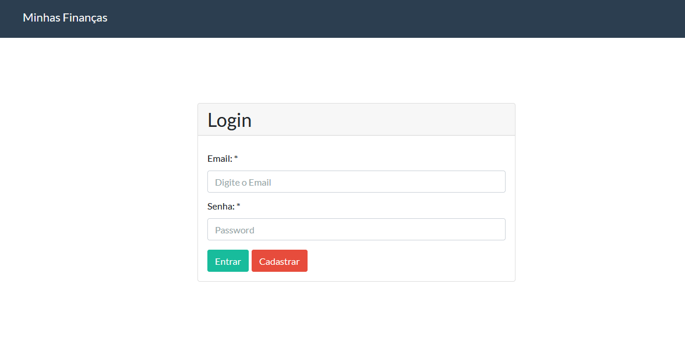
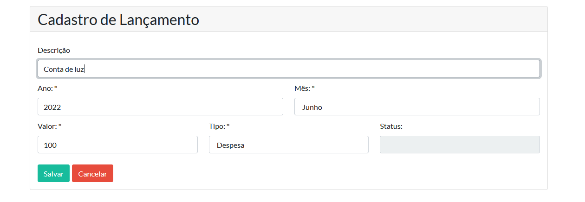
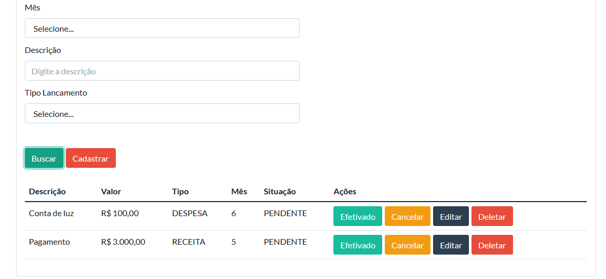

## Full stack finance project with Java Spring boot

### This project consists of the development of a full stack application that will use the following technologies:

- Java11
- Springboot 2.1
- APIRest
- JWT
- Junito
- heroku
- PostgreSQL
- React.JS

 
 

